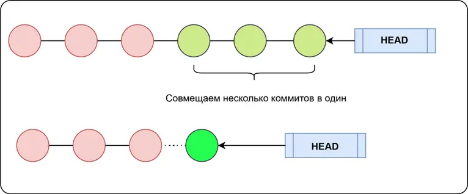
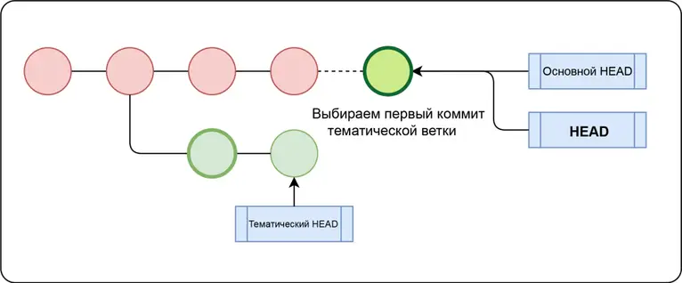

[< К содержанию](/README.md)

# Продвинутое использование

## **Интерактивная подготовка**

Вы можете с удобством управлять областью подготовленных файлов (например при фиксации нескольких небольших коммитов вместо одного большого) с помощью интерактивной консоли, которую можно запустить с *`git add -i`*. В ней есть 8 команд:

`status` — показывает для каждого файла краткое описание того, что (не)подготовлено;  
`update` — подготавливает отслеживаемые файлы;  
`revert` — убрать один или несколько файлов из подготовленной области;  
`add untracked` — подготавливает неотслеживаемый файл;  
`patch` — подготавливает только часть файла (полезно, когда вы, например, изменили несколько функций, но хотите разбить изменения на несколько коммитов). После выбора файла вам будут показаны его фрагменты и представлены возможные команды: *`Stage this hunk [y,n,q,a,d,j,J,g,/,e,?]?`*. Можно ввести `?`, чтобы узнать, что делает каждая команда;  
`diff` — показывает список подготовленных файлов и позволяет посмотреть изменения для каждого из них;  
`quit` — выходит из интерактивной консоли;  
`help` — показывает краткое описание каждой команды.  
Символ `*` рядом с файлом означает, что команда изменит его статус (подготовлен/неподготовлен в зависимости от того, происходит ли обновление или откат). Если нажать Enter, не введя ничего ни в одном из под-меню команды, то все файлы перейдут в (не)подготовленное состояние. Создание патчей доступно в интерактивной консоли и через команду *`git add -p`*.

## **Правка истории**
Для большего контроля над историей коммитов локальной ветки можно использовать команду *`git rebase -i HEAD~n`*, которая откроет интерактивную консоль для перемещения набора последних `n` коммитов, перечисленных в порядке от старых к новым (то есть в том порядке, в котором они будут перемещены). Таким образом вы можете «редактировать историю», однако помните, что оригинальные коммиты нельзя изменить, только переместить.

Вы можете поменять порядок коммитов, изменив порядок, в котором они перечислены.

 **Изменение сообщения/разбивка коммитов**
Для указания коммита, который вы хотите изменить, используется команда edit. Затем, когда Git будет проводить перемещение, он остановится на этом коммите. После этого вы можете использовать *`git commit --amend`*, чтобы изменить сообщение или подготовить забытые файлы. Если вы хотите разделить коммит, после остановки введите *`git reset HEAD^`* (в результате HEAD будет перемещён на один коммит назад и все изменённые в этом коммите файлы перейдут в статус неподготовленных). Затем вы сможете зафиксировать файлы в отдельных коммитах обычным образом.

После завершения редактирования введите *`git rebase --continue`*.

**Перезапись нескольких коммитов**
Иногда вам может потребоваться перезаписать несколько коммитов — в таких случаях можно использовать *`git filter-branch`*. Например, чтобы удалить случайно зафиксированный файл, можно ввести *`git filter-branch --tree-filter 'git rm -f <имя файла>' HEAD`*. Однако учтите, что при этом вся история перемещается.

**Объединение нескольких коммитов**

Если коммиты незначительные и небольшие, это может засорить историю проекта. В связи с этим можно объединить несколько коммитов в один большой. Используйте команду `pick` для выбора первого коммита и `squash` для последующих.

**Перенос отдельного коммита**
Кроме слияния/перемещения всех коммитов в тематической ветке, вас может интересовать только определённый коммит. Допустим, у вас есть локальная ветка drafts, где вы работаете над несколькими потенциальными статьями, но хотите опубликовать только одну из них. Для этого можно использовать команду *`git cherry-pick`*. Чтобы получить определённые коммиты, из которых мы хотим выбирать, можно использовать *`git log <основная ветка>..<тематическая>`*.

Обратите внимание, что таким образом создаётся новый коммит, который только повторяет `diff` выбранного коммита (то есть разницу между этим коммитом и предыдущим), но не его состояние.

