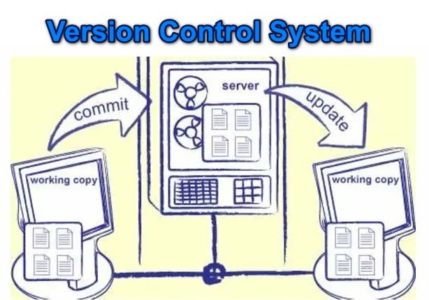

[< К содержанию](./README.md)


# Типы систем контроля версий
## Локальные СКВ  

Среди первых систем подобного плана была RCS/СКВ, разработанная в 1985 году и сразу ставшая популярной.

Данная система контроля версий хранит и все зарегистрированные в ней файлы, и любые вносимые в них изменения. Специально к текстовым файлам применяется алгоритм дельта-компрессии. Это означает, что система сохраняет последнюю версию и все предшествующие ей изменения.

СКВ подобного плана решали лишь проблему хранения больших объемов данных.

Современные СКВ условно бывают двух видов:  

  ### Централизованные

Такие как, к примеру, CVS, Subversion, Perforce. Они имеют собственный центральный сервер, где накапливаются все файлы проекта. Система контролирует и их сохранность, и выдачу их копий определенному ряду пользователей. Именно по такой схеме много лет и работали СКВ.



### Распределённые

В распределенных системах контроля версии технически все версии проекта равны.  
К примеру, Git, Mercurial, Bazaar, Darcs. Суть их работы состоит в выгрузке клиентам не только версий файлов с последними изменениями, а всего репозитория.   

Репозиторий (на сленге – «репа») – это место хранения и поддержания данных. Более того, условно говоря, различают центральный и локальные репозитории.


``` 
Из локальных изменения выгружаются в центральный, с которым они (локальные репозитории) непременно синхронизируются. И в случае «обвала» основного сервера продолжить работу можно, взяв базу данных с любого клиентского компьютера.
```
Еще один плюс подобных систем в том, что в большинстве из них доступно для хранения данных сразу нескольких удаленных репозиториев.


